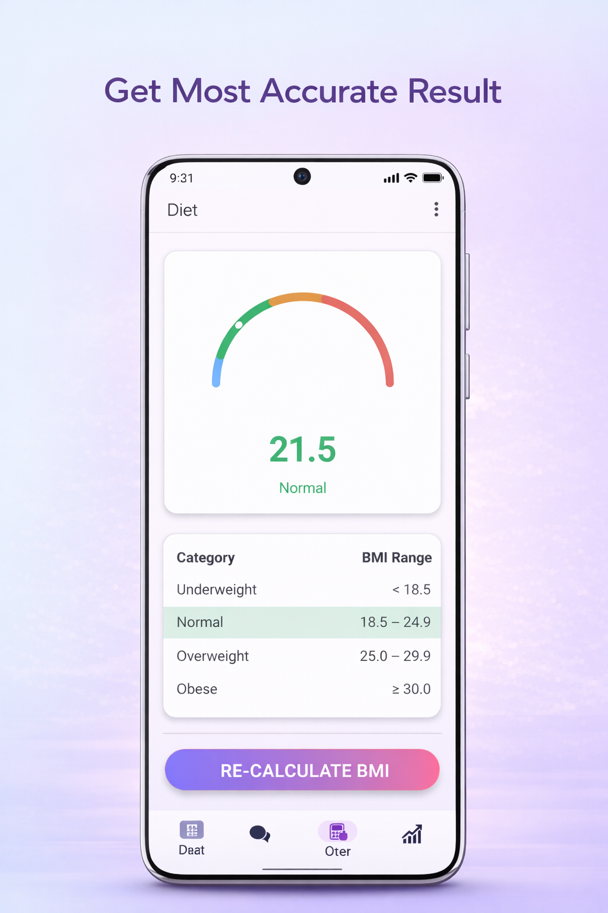
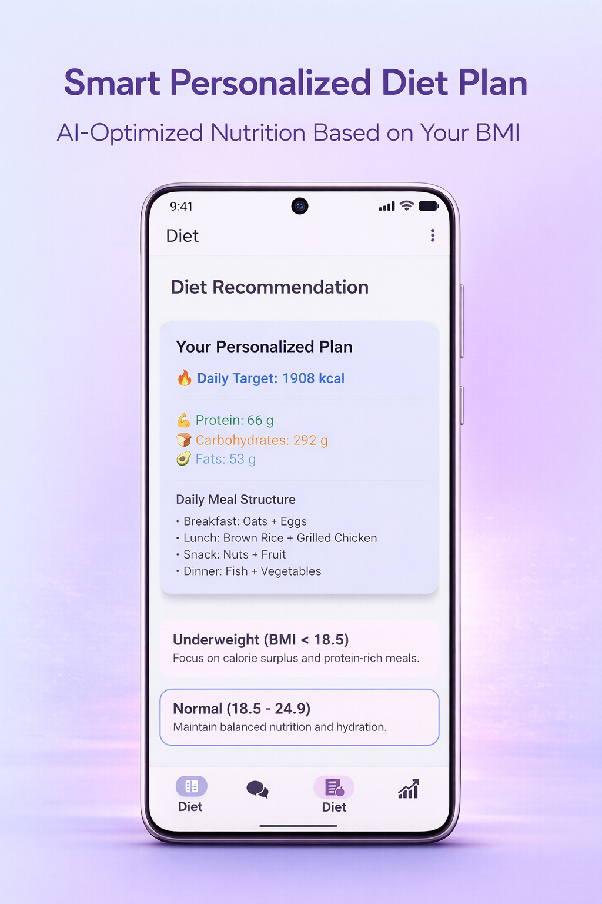
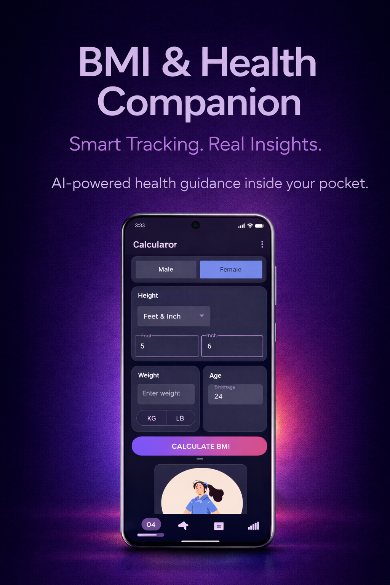
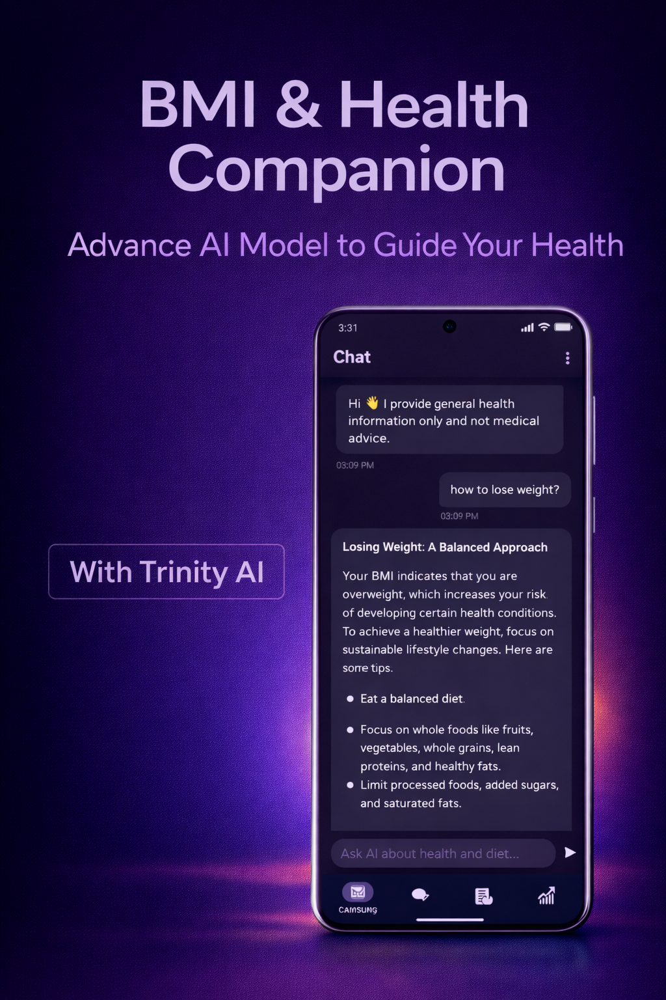

---

# 📱 BMI & Health Companion

### AI-Powered Android Health Assistant (Kotlin + MVVM + LLaMA 3)

A modern, privacy-focused **BMI tracking and AI health assistant** built with **Kotlin**, **Material 3**, and a scalable **MVVM architecture**.

The application combines accurate BMI calculation, local progress tracking, and an integrated **LLaMA 3-powered AI assistant** to provide structured health guidance.

---

# 🚀 Overview

BMI & Health Companion is designed as a **hybrid architecture application**:

* ✅ Core health features work fully offline
* 🌐 AI assistant operates via secure LLaMA 3 API integration
* 🔒 No analytics, no tracking, no ad SDKs

The goal is to demonstrate clean Android architecture, modern UI practices, and real-world AI integration within a production-style app.

---

# ✨ Features

## 📏 BMI Calculation (Offline)

* Height (Feet/Inch or CM)
* Weight (KG / LB)
* Age & Gender input
* Accurate BMI computation
* Automatic BMI category classification:

  * Underweight
  * Normal
  * Overweight
  * Obese

All calculations are performed locally on-device.

---

## 📊 Visual BMI Dashboard

* Dynamic BMI gauge
* Category-based color coding
* Health interpretation summary
* Recalculate functionality

---

## 🕒 BMI History Tracking

* Local storage using **Android DataStore**
* View historical BMI records
* Delete individual entries
* Clear entire history
* No cloud storage

---

## 🤖 AI Health Assistant (Powered by LLaMA 3)

Integrated conversational assistant designed to provide structured health guidance.

### Capabilities

* Context-aware responses
* BMI-based health suggestions
* General nutrition and lifestyle guidance
* Structured bullet-point responses
* Controlled response length via system prompt engineering

### AI Architecture

```
ChatFragment
      ↓
ChatViewModel
      ↓
Prompt Builder (System + User Context)
      ↓
LLaMA 3 API Service Layer
      ↓
Response Parsing
      ↓
RecyclerView Rendering
```

### Important

* AI requires internet connection
* No personal data stored on external servers
* No analytics or user profiling
* AI provides informational guidance only (not medical advice)

---

# 🏗️ Architecture

The app follows clean **MVVM architecture**:

```
UI → ViewModel → Domain → Data
```

### Principles

* Separation of concerns
* Single source of truth
* Reactive state management
* Scalable AI service abstraction
* Lifecycle-aware components

---

# 🧠 Technical Stack

| Layer            | Technology                   |
| ---------------- | ---------------------------- |
| Language         | Kotlin                       |
| UI               | XML + Material 3 (DayNight)  |
| Architecture     | MVVM                         |
| State Management | StateFlow                    |
| Navigation       | Jetpack Navigation Component |
| Persistence      | DataStore (Preferences)      |
| Networking       | Retrofit / HTTP Client       |
| AI Model         | LLaMA 3 (API-based)          |
| Build System     | Gradle                       |
| Minimum SDK      | 30                           |

---

# 🔐 Privacy & Security

BMI & Health Companion is built with a privacy-first mindset.

### What the app does NOT do:

* ❌ No ads
* ❌ No analytics SDK
* ❌ No tracking
* ❌ No cloud storage of BMI history
* ❌ No personal data collection

### Hybrid Connectivity Model

* BMI calculations: fully offline
* AI assistant: requires internet (LLaMA 3 API)

This ensures local health tracking remains independent of network access.

---

# 🖼 Screenshots

## 🌤 Light Mode

<p align="center">
  
  
</p>

## 🌙 Dark Mode

<p align="center">
  
  
</p>

---

# 🧩 Project Structure

```
com.iamnippon.bmiandhealth
│
├── ui/
│   ├── input/
│   ├── result/
│   ├── history/
│   └── chat/
│
├── viewmodel/
│
├── data/
│   └── datastore/
│
├── domain/
│   └── usecases/
│
└── utils/
    └── BmiUtils.kt
```

---

# ⚠️ Health Disclaimer

BMI is a general health indicator and not a medical diagnosis.

The AI assistant provides general informational guidance only and does not replace consultation with qualified healthcare professionals.

---

# 🛠️ Setup Instructions

## Clone the Repository

```bash
git clone https://github.com/iamnippon/BMI-APP-Kotlin.git
```

## Open in Android Studio

* Android Studio Flamingo or newer recommended
* Sync Gradle
* Run on emulator or physical device (API 30+)

---

# 🔑 AI API Configuration

To enable AI functionality:

1. Obtain a LLaMA 3 API key (e.g., via Groq, OpenRouter, or other provider)
2. Add your API key securely (do NOT hardcode in production)
3. Configure base URL in your network layer

> ⚠️ Never commit API keys to GitHub.

---

# 📦 Release

* Distributed via Android App Bundle (.aab)
* Complies with Google Play publishing requirements
* Tested via closed testing track before production

---

# 🎯 Learning & Engineering Focus

This project demonstrates:

* Modern Android architecture (MVVM)
* Material 3 theming (Light & Dark)
* StateFlow-based reactive UI
* DataStore persistence
* Clean prompt engineering
* API-based AI integration
* Structured system prompt design
* Hybrid offline/online architecture

---

# 👨‍💻 Developer

**Nippon Chowdhury**
Android Developer | Computer Science

* 🌐 [https://iamnippon.dev](https://iamnippon.dev)
* 🐙 [https://github.com/iamnippon](https://github.com/iamnippon)
* 📸 Instagram: [https://instagram.com/nippon.chowdhury](https://instagram.com/nippon.chowdhury)
* ❌ X (Twitter): [https://x.com/NipponChy](https://x.com/NipponChy)

---

# ⭐ Support

If you find this project useful:

* ⭐ Star the repository
* 🐛 Report issues
* 💡 Suggest improvements
* 🍴 Fork and experiment

---

# 📄 License

Licensed under the **MIT License**.

---

If you want next-level polish, I can:

* 🔥 Make it look like a startup product README
* 🎓 Optimize it specifically for MSc/PhD applications
* 💼 Optimize for Australian tech recruiters
* 🧠 Add future roadmap (on-device AI, quantized LLaMA, etc.)

Tell me your goal and I’ll tailor it strategically.
# BMI-Health-Monitor
